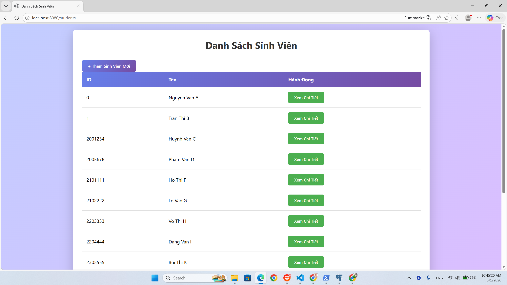
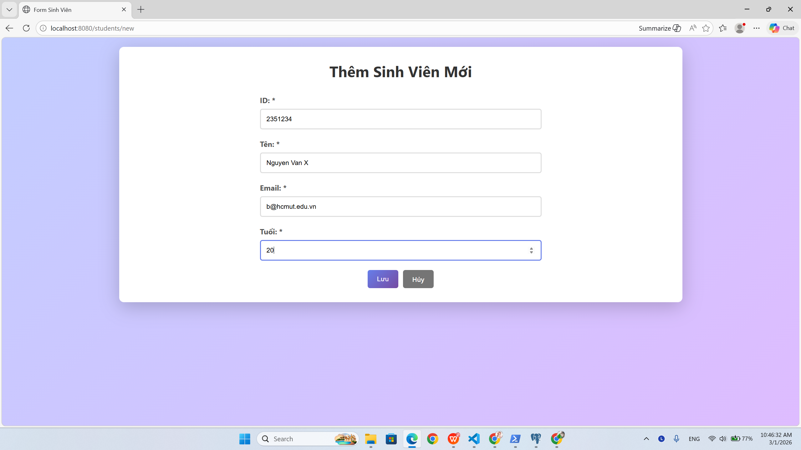
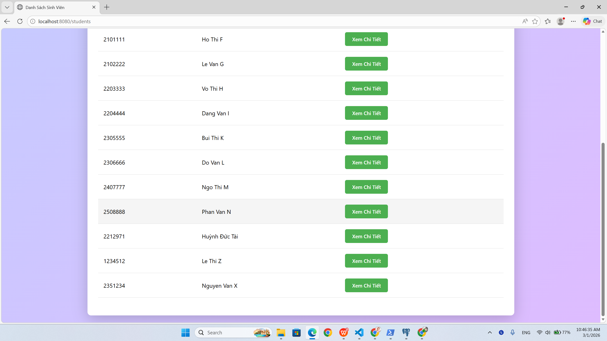
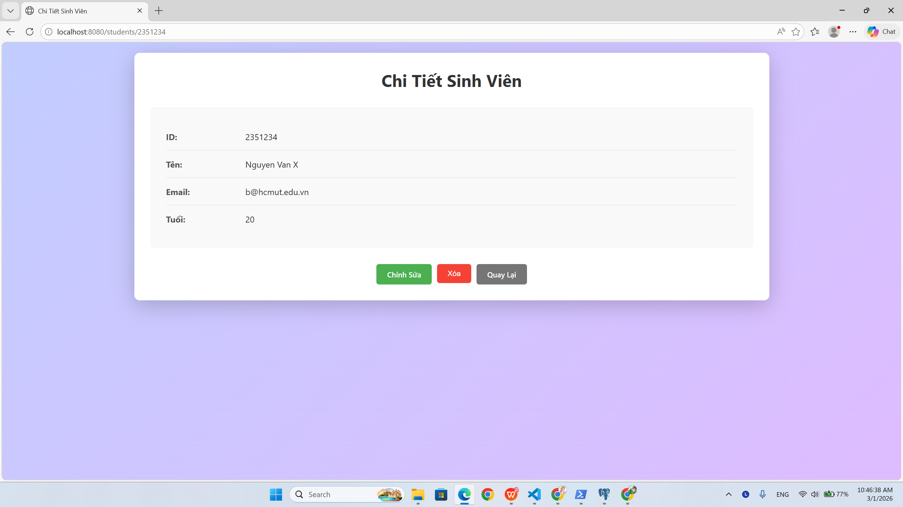
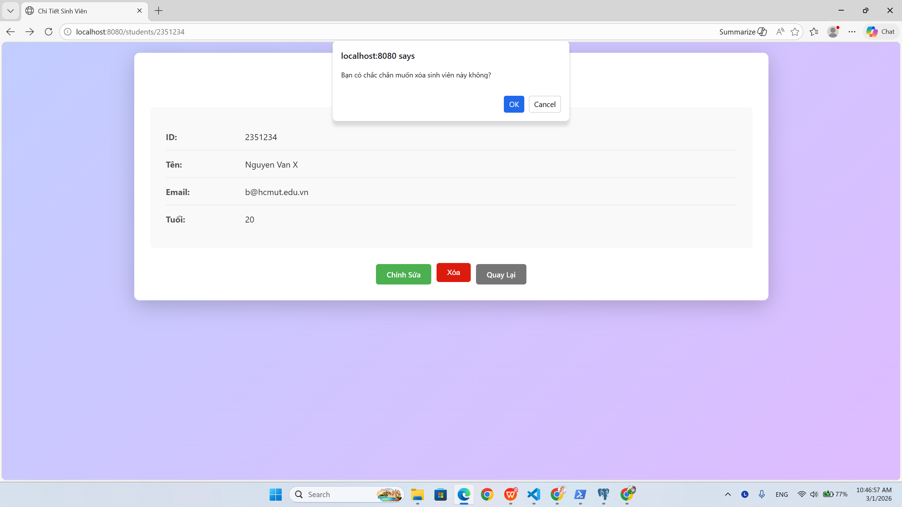
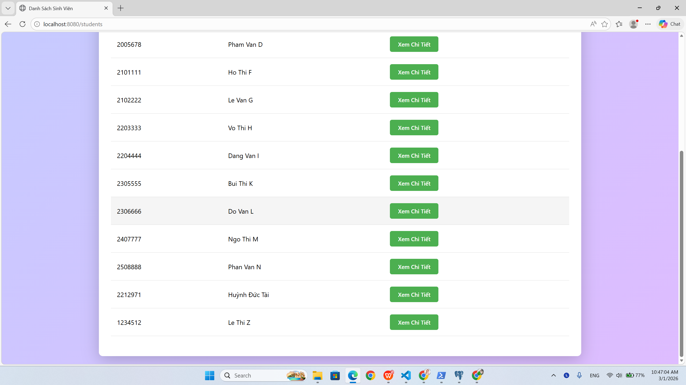

# TÊN DỰ ÁN

## 1. Thông tin nhóm
- **Tên nhóm:**  
- **Thành viên:**
  - Lê Đức Tâm - 2213016
  - Huỳnh Đức Tài - 2212971

---

## 2. Public URL của Web Service (Lab 5)
- **URL:**  

https://your-public-url-here

- **Mô tả ngắn:**  
Web Service được deploy từ Lab 5, cung cấp các API phục vụ cho ứng dụng.

---

## 3. Hướng dẫn chạy dự án
**3.1. Yêu cầu môi trường**

Java Development Kit (JDK): 17

Maven: 3.8 trở lên

Database: PostgreSQL

Docker: (không bắt buộc, chỉ dùng nếu chạy bằng container)

**3.2. Cài đặt**

Clone source code từ repository:

git clone <repository-url>
cd <project-folder>
**3.3. Cấu hình môi trường**

Tạo file .env tại thư mục gốc của project và cấu hình như sau:

POSTGRES_HOST=localhost
POSTGRES_PORT=5432
POSTGRES_DB=database
POSTGRES_USER=username
POSTGRES_PASSWORD=password

SPRING_DATASOURCE_URL=jdbc:postgresql://${POSTGRES_HOST}:${POSTGRES_PORT}/${POSTGRES_DB}
SPRING_DATASOURCE_USERNAME=${POSTGRES_USER}
SPRING_DATASOURCE_PASSWORD=${POSTGRES_PASSWORD}

Lưu ý:

PostgreSQL phải đang chạy trước khi khởi động ứng dụng

Database cần được tạo sẵn trong PostgreSQL

**3.4. Chạy dự án**
Cách 1: Chạy bằng Maven
mvn clean spring-boot:run
Cách 2: Build và chạy file JAR
mvn clean package
java -jar target/student-0.0.1-SNAPSHOT.jar
(Tuỳ chọn) Chạy bằng Docker
docker build -t student-app .
docker run -p 8080:8080 --env-file .env student-app
**3.5. Truy cập ứng dụng**

Web UI:
http://localhost:8080

REST API:
http://localhost:8080/api/students

## 4. Câu trả lời lý thuyết (Lab)
**Câu 2.** Ràng buộc Khóa Chính (Primary Key)

*Câu hỏi:*
Tại sao khi cố tình insert một sinh viên có id trùng với sinh viên đã tồn tại, cơ sở dữ liệu lại trả về lỗi UNIQUE constraint failed và chặn thao tác này?

*Trả lời:*
Do cột id được khai báo là khóa chính (Primary Key), nên giá trị của nó phải là duy nhất và không được trùng lặp. Khi insert một bản ghi có id trùng với bản ghi đã tồn tại, cơ sở dữ liệu phát hiện vi phạm ràng buộc UNIQUE và từ chối thao tác để đảm bảo tính toàn vẹn dữ liệu.

**Câu 3.** Toàn vẹn dữ liệu (Constraints)

*Câu hỏi:*
Khi insert một sinh viên nhưng để trống cột name (NULL), cơ sở dữ liệu có báo lỗi không, và sự thiếu ràng buộc này ảnh hưởng như thế nào khi code Java đọc dữ liệu?

*Trả lời:*
Nếu cột name không được khai báo ràng buộc NOT NULL, cơ sở dữ liệu sẽ không báo lỗi và vẫn cho phép insert dữ liệu. Điều này có thể gây ra lỗi trong quá trình xử lý ở Java, chẳng hạn như NullPointerException, hiển thị dữ liệu không đầy đủ hoặc sai logic nghiệp vụ của ứng dụng.

**Câu 4. Cấu hình Hibernate**

*Câu hỏi:*
Tại sao mỗi lần tắt ứng dụng và chạy lại, dữ liệu cũ trong cơ sở dữ liệu lại bị mất hết?

*Trả lời:*
Nguyên nhân là do cấu hình spring.jpa.hibernate.ddl-auto được đặt ở chế độ create hoặc create-drop, khiến Hibernate tự động xóa và tạo lại các bảng trong cơ sở dữ liệu mỗi khi ứng dụng khởi động, dẫn đến việc toàn bộ dữ liệu cũ bị mất.

## 5. Screenshot các module (Lab 4)
## Screenshot

### Trang chính

### Thêm sinh viên

### Thêm sinh viên thành công

### Xem chi tiết sinh viên

### Xóa sinh viên

